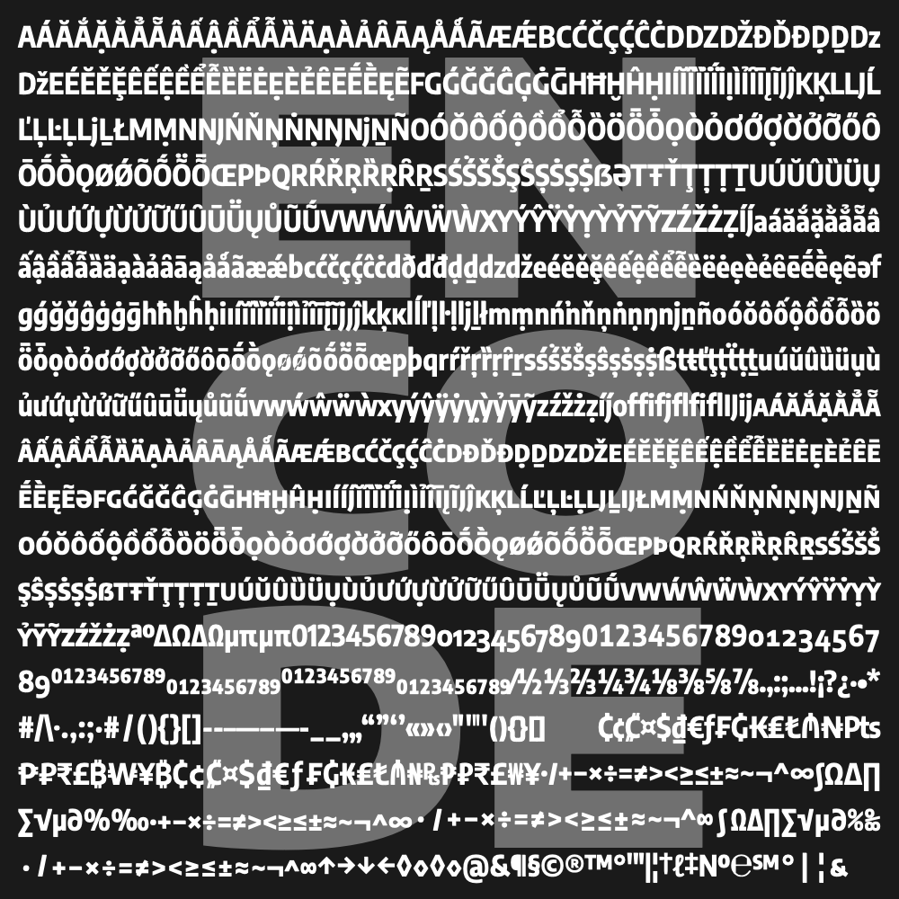

Encode Sans Fonts
=================



This project is forked from Pablo Impallari's original repo in order to upgrade the family to a variable font and make some small refinements.The description from the original is:

> The Encode Sans family is a versatile workhorse. Featuring a huge range of weights and > widths, it's ready for all kind of typographic challenges. It also includes Tabular and > Old Style figres, as well as full set of Small Caps and other Open Type features.
> 
> Designed by Pablo Impallari and Andres Torresi.
> 
> Released under the SIL Open Font License.
> 
> #### Encode Sans covers all 104 Latin Languages:
> 
> Afar, Afrikaans, Albanian, Azerbaijani, Basque, Belarusian, Bislama, Bosnian, Breton, > Catalan, Chamorro, Chichewa, Comorian, Croatian, Czech, Danish, Dutch, English, Esperanto, > Estonian, Faroese, Fijian, Filipino/Tagalog, Finnish, Flemish, French, Gaelic (Irish / > Manx / Scottish), Gagauz, German, Gikuyu, Gilbertese/Kiribati, Greenlandic, Guarani, > Haitian_Creole, Hawaiian, Hungarian, Icelandic, Igo/Igbo, Indonesian, Irish, Italian, > Javanese, Kashubian, Kinyarwanda, Kirundi, Latin, Latvian, Lithuanian, Luba/Ciluba/Kasai, > Luxembourgish, Malagasy, Malay, Maltese, Maori, Marquesan, Marshallese, > Moldovan/Moldovian/Romanian, Montenegrin, Nauruan, Ndebele, Norwegian, Oromo, > Palauan/Belauan, Polish, Portuguese, Quechua, Romanian, Romansh, Sami, Samoan, Sango, > Serbian, Sesotho, Setswana/Sitswana/Tswana, Seychellois_Creole, SiSwati/Swati/Swazi, > Silesian, Slovak, Slovenian, Somali, Sorbian, Sotho, Spanish, Swahili, Swedish, Tahitian, > Tetum, Tok_Pisin, Tongan, Tsonga, Tswana, Tuareg/Berber, Turkish, Turkmen, Tuvaluan, > Uzbek/Usbek, Wallisian, Walloon, Welsh, Xhosa, Yoruba, Zulu.
 
# Build Process

The sources can be built with FontMake, but I've put together some specific build scripts to pass the fonts through some steps that fix metadata issues.

The build process requires you to open up a terminal and navigate to this project's directory.

## Step 1: Install Requirements

I suggest using a Python virtual environment to build this project. If you've never set up a virtual environment before, [read more virtualenv in this guide](https://medium.com/python-pandemonium/better-python-dependency-and-package-management-b5d8ea29dff1).

First, set up a virtual environment with:

```
virtualenv -p python3 venv
```

Here, `venv` will be the name of the virtual environment and of the folder holding its dependencies. You need to activate it with:

```
source venv/bin/activate
```

To operate the scripts within this repo, install requirements with:

```
pip install --upgrade -r requirements.txt
```

**Note on autohinting:** You will also need to download this build of [TTFautohint-vf](https://groups.google.com/forum/#!searchin/googlefonts-discuss/ttfautohint%7Csort:date/googlefonts-discuss/WJX1lrzcwVs/SIzaEvntAgAJ), and place the file directly into the new `venv/bin` within this project.

To exit out of the virtual environment, you can use the command `deactivate` (just remember to start it up again if you come back).

## Step 2: Give permissions to build scripts

The first time you run the build, you will need to give run permissions to the build scripts.

On the command line, navigate to the project folder (`cd Encode-Sans`), and then give permissions to the shell scripts with:

```
chmod -R +x sources/scripts
```

The `-R` applies your permission to each of the shell scripts in the directory, and the `+x` adds execute permissions. Before you do this for shell scripts, you should probably take a look through their contents, to be sure they aren't doing anything bad. The ones in this repo simply build from the GlyphsApp sources and apply various fixes to the results.

## Step 3: Run the build scripts!

You can then build sources by running shell scripts in `sources/scripts/`.

```
sources/scripts/build.sh <flag>
```

Add one of the are the following flags to build the fonts:

`--statics` or `-s` to build the static TTF instances (there are 45, so it takes awhile)

`--split` or `-sp` to build the split variable fonts (split into 5 width families, each with a variable weight axis).

`--full` or `-f` to build the one full variable font, with weight & width axes

`--all` or `-a` to build all of the fonts and take a coffee break.

### Building Split VFs

If you want to build only a specific "split width" variable font, you can build this with:

```
sources/scripts/build-split-vf.sh <flag>
```

`--condensed` or `-c` to build the Condensed split VF (and its smallcap sibling)

`--semicondensed` or `-sc` to build the SemiCondensed split VF (and its smallcap sibling)

`--normal` or `-n` to build the normal-width split VF (and its smallcap sibling)

`--semiexpanded` or `-se` to build the SemiExpanded split VF (and its smallcap sibling)

`--expanded` or `-e` to build the Expanded split VF (and its smallcap sibling)

(Thanks to [@mjlagattuta](https://github.com/mjlagattuta)) for coming up with the way to add flags, and to [@jonalmeida](https://github.com/jonalmeida) for writing [such a good blog post about it](https://jonalmeida.com/posts/2013/05/26/different-ways-to-implement-flags-in-bash/)).

# Build steps after edits to primary source

This project has a "primary" source file which has received design updates, refinements, and QA. However, at present, the Google Fonts library requires weight-only variable fonts (also called "normal" or "split" variable fonts in this repo). To fulfill this, a script is used to derive a normal-width-only Glyphs file from the primary source, from which the width-only variable font is built.

Due to [current limitations in remote scripting for GlyphsApp](https://forum.glyphsapp.com/t/instance-as-master-through-core-api/10502/12), the additional GlyphsApp source must be generated using a Python script in GlyphsApp, rather than something triggered in the build process itself. So, if you wish for edits to the design to cascade into the final outputs, you must use a partially-manual build process, wherein a few processing steps are done to make "build-ready" sources. These steps are as follows:

1. Open your Glyphs Scripts folder in a terminal window and add this repo's source-splitting script as a symlink with `ln -s YOUR_PATH/sources/scripts/helpers/split-encode-vf-glyphs_script.py`

2. Open the main source (`sources/Encode-Sans.glyphs`) in Glyphs. Run the _"Split-up Weight-VF Sources, Encode Sans"_ script.

The GlyphsApp source will be split into several build-ready, single-axis sources.

# Variable font upgrade project documentation

Notes were taken throughout the variable font upgrade project and added to the [docs](/docs) directory. I tend to take notes while working anyway, in order to think through problems and record solutions for later reference. In this project, I have included these in the repo so that others might find references to solve similar problems, especially because variable font-making processes are relatively new, and there is a general scarcity of online knowledge on font mastering. Because they were often made alongside work, the notes can at times be a bit disjointed. Hopefully they are still helpful to others! 

If you have any questions about the project or the notes, feel free to [file an issue](/issues) or to reach out to Stephen Nixon via Twitter ([@thundernixon](https://twitter.com/thundernixon)) or other social media (typically also @thundernixon).

# Further work-in-progress in `wip` branch

There are a few details currently still being cleared up and improved. While this is happening, this work will take place in the `wip` branch, and the latest font outputs will be moved into the `master` branch as they are created.