# Variable Font issue: Variable fonts with non-rectangular designspaces export with unpredictable failures. FontMake (?) should fix this.

## Summary

It would be useful for FontMake to provide a way to automatically morph designspace values to morph trapezoidal designspaces (including designspaces generated from Glyphs files) into rectangular designspaces.

## The problem

If a type family has multiple axes and is designed in such a way that axes don’t form a rectangular designspace, FontMake will still export the variable font\*, but the variable font will have weird failures when the axes are adjusted.

_\*Sometimes it won’t export. There is a related issue in the non-rectangular designspace of Clarendon, where the minimum weights don’t line up between widths. This doesn’t export, but that will be written about separately. This document will focus on a cliff beyond uneven maximum weight values._

## One symptom of the problem: a “weight cliff” in an exported variable font.

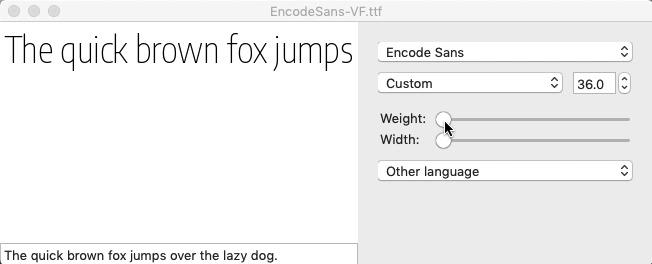

**The Cause: the Glyphs files has different values for the narrow and wide heavy masters**

- Bold Condensed is `193`
- Bold Extended is `232`
- (Light Condensed is `34`)
- (Light Extended is `34`)

**Where did these values come from?**
The designer of this font (Pablo Impallari) used the measurements of lowercase stems as the weight values for this typeface. Stems in the bold extended letters were thicker than stems in the bold condensed letters, resulting in different weight values between them.

This approach to planning and specifying weight values was used by Pablo in more typefaces, and he publicized it as a method for others to use for weight planning. As a result, similar issues are likely in many faces besides Encode Sans.

## **Visualizing the problem**

Let’s visualize the issue in Superpolator. To do so, we must:

1. change the `.designspace` file version from 4 to 3 in line 2 of the XML with `<designspace format="3">`
2. delete the kerning `<lib>` info
3. set Superpolator Axis info so that the Weight min is 34, and the weight max is 232 (simply matching the input data – the axis `<map>` doesn’t work here).

If the `wght` values are different between different masters in the family, the weight cliff issue is present. In Superpolator, the family and instances have a distribution that looks like a trapezoid:

_This trapezoidal grid shows masters (in the corners) and instances (other nodes) from Encode, arranged spatially by weight and width values_:

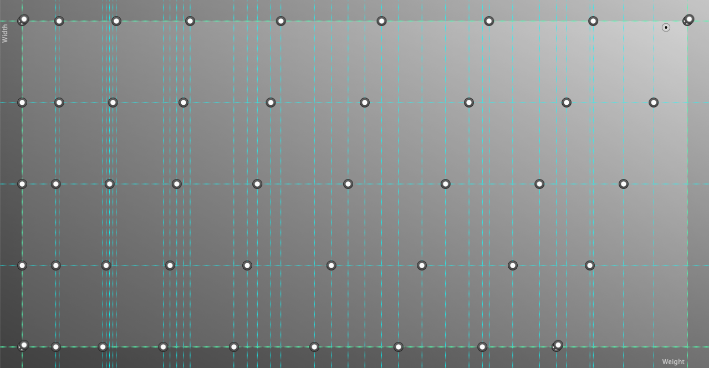

In the narrow-heavy corner, then, weight issues start to come up: it is an extrapolation area. This extrapolation somewhat works in Superpolator, but is shown as the “weight cliff” in Encode VF.

_A variable font won’t extrapolate, but this does show that things “break” in the non-covered corner_:

**What’s causing the “cliff” in the exported version?**
The exported version would require extrapolation to show anything at narrow-width & full-weight (or anything in that triangle of dead space). However, “**_extrapolation_** **beyond the values defined by the masters is not supported in variable fonts**” ([Erik van Blokland](https://github.com/fonttools/fonttools/issues/671)).

## **A hacky fix**

If the designspace document is edited to

- set both of the heavy masters to the max wght value, and
- erase the instances

…then the exported varfont works well.

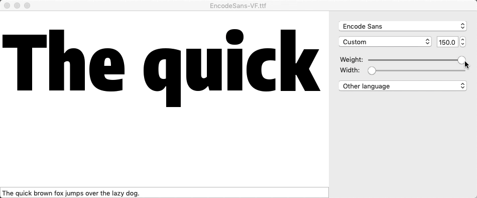

…_but_ the named instances no longer exist, so this hack doesn’t work, yet.

## **Eliminating the extrapolation area, two less-hacky fixes**

How might we take Glyphs files which have taken Pablo’s approach, and automatically map their designspace values to a rectangular range to eliminate extrapolation areas (or to a cubic range, or a tesseractic range, etc, depending on number of axes)? Once we do, will the named instances match the previously-exported static instances? Let’s examine the first question, first.

**Option 1: A Quick Fix**

Another way to eliminate the extrapolation zone: simply duplicate the condensed bold master into the far corner. This makes a triangle of “dead space” – area where the `wght` slider moves, but doesn’t affect the letter shapes – without having to morph the positioning of any instances within the designspace.

In Superpolator, that looks like this:

It’s the same designspace as before, but now there is a deadspace and no extrapolation area.

**Option 2: A Mathematical Fix**
So, the designspace needs to be morphed in order to allow a viable export. I quickly adjusted the designspace values, putting the bold weights of the narrow bold master and all black instances to a common max value, then opened this in Superpolator.

Here’s the preliminary result (this is **not** the “math fix” yet):

For an initial test, I’ll make some calculations to place instances for each width so that they reach a maximum of 232, with the same distribution as they previously had. Basically, I’ll just compute ratios to make them equal. Here’s a sketch of the math:

    # Example: Encode Sans SemiCondensed SemiBold
    # Original weight value: 126
    # Original max weight value of SemiCondensed: 203

    # 126    x
    # --- = ---
    # 203   232

    # 126 * 232 = 29232
    # 29232 / 203 = 144

    # New weight of SemiCondensed SemiBold = 144

    # oldWght * newMax / oldMax = newWght

    ### BUT, this would only be accurate if the min weight were 0

To be accurate, we also need to take into account the `min` wght of 34. We can determine this with some simple Python:

    oldWght = 193 # update for each instance

    oldMin = 34
    newMin = 34

    oldMax = 193 # update for each width series
    newMax = 232

    newWght = (oldWght - oldMin) * (newMax - newMin) / (oldMax - oldMin) + newMin

    print(round(newWght, 3)) # rounded to 3 decimals
     # 34. If we don't subtract and add 34 along the way, the result is incorrectly 38.857

This works! It keeps both axes usable across their whole range.

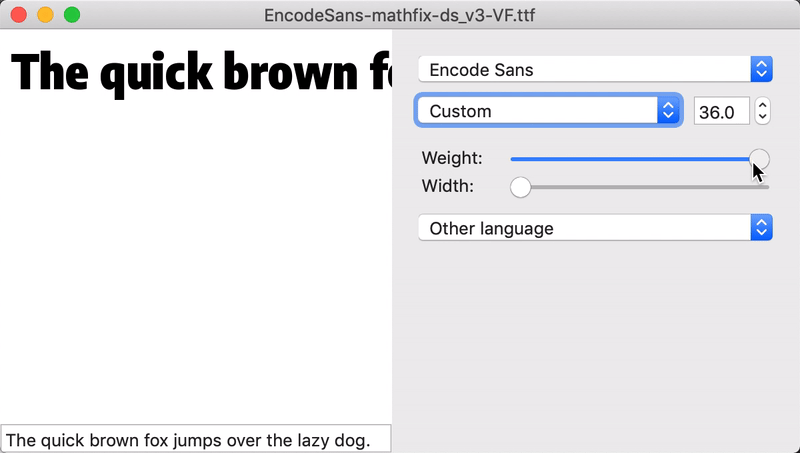

When put into Superpolator, this shows that, not surprisingly, the original designer had done the math to keep instances proportional across widths, so when the designspace is morphed into a rectangle, the instances line up between widths (with slight variations from rounding, likely in the initial phase and in the current phase).

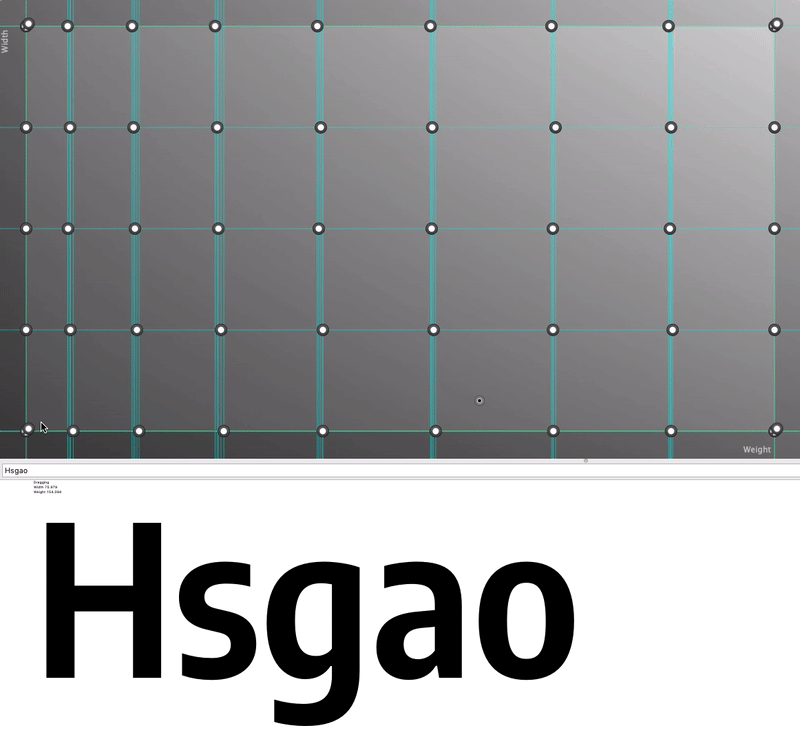

**Option 3: a “simple fix”**

In the Superpolator visualization, it can be seen that the instances _almost_ line up into a grid – but not quite (the vertical blue guidelines show their slight misalignment).

In looking at the `wght` values of instances, I noticed that my mathematical approach led to values which were very close to the values for the widest instances. E.g. `Encode Sans Condensed Bold` had a computed weight value of `173.472` while `Encode Sans Extended Bold` had a weight value of 173. All my computed values were just a bit too high – almost always by less than `1`, and only by more than `2` in one instance.

Matching the weight value numbers of all instances to the weight values in the `Extended` widths created a perfect grid of instances (so long as the Narrow Bold master was set to the max weight value, `232`).

## **Vital question: are the instances the same as before?**

A primary success metric in the VF version of Encode is that named instances will match existing static instances, so as not to break websites or layouts using these static instances.

Using [gfregression](https://github.com/googlefonts/gfregression) (currently, Marc Foley’s fork > `vf` branch of it), the output instances can be compared against the status-quo static instances across a wider range of glyphs. This workflow is still being improved, so it is slightly hard to tell which differences may be coming from the testing tool and which differences are coming from my export workflow.

To properly compare outputs, one must make sure that:

- the proper `wdth` value is specified when comparing the variable font against static instances, e.g. by adding the relevant CSS `font-variation-settings: 'wght' 400, 'wdth' 500;`.
  - (I’m not sure whether it’s my error or not, but I can only seem to export a variable font via fontmake if I have the “default” axis values set to the same values as one of my input masters – however, this leads gfregression to just use the default font width. Maybe this will change once font width values are more formalized?)
- (currently) that kerning is turned off in both fonts
  - I’m not sure why yet, but the kerning is different between the current static font and the exported variable font
    _When the varfont is set to the correct wght and wdth values and kerning is removed, the outlines seem to be almost exactly the same as the static font, though maybe there is a “wiggle” between them._:

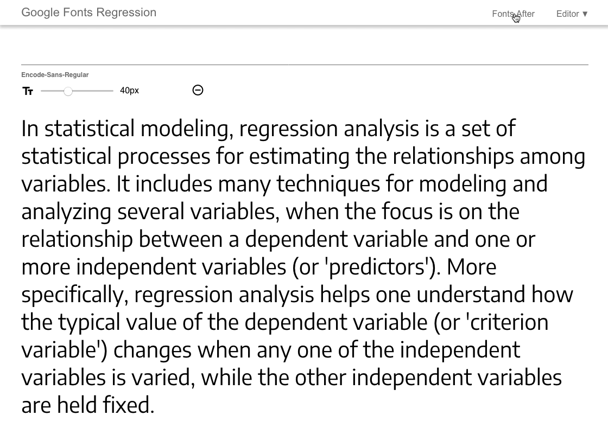

I am currently working to test this in Drawbot (here’s my [test code](https://github.com/thundernixon/Encode-Sans/blob/6dbccf8a021976e17a4410ccc5abf8772621b6c4/tests/var_vs_static-2018-10-08-18_15/static_vf_comparison-drawbot-100818.py)). Despite one [odd error](https://github.com/typemytype/drawbot/issues/230), it is showing useful results. I have made the static font magenta and the variable font green, then used a blend mode of “screen” to show overlap in white and differences in color. (Click to enlarge)

_With the “math fix” and “simple fix,” letters are extremely close to the original static instances_:

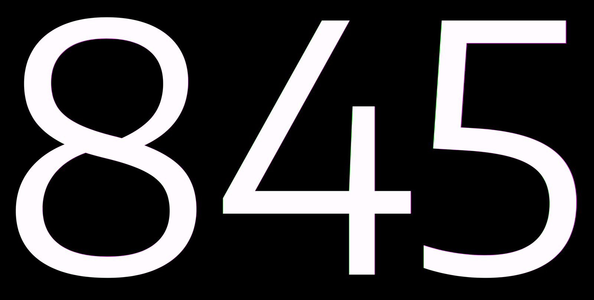

_“quick fix” causes the worst text reflow, partly because the “regular” weight doesn’t fall at 400 here, as Font Bakery QA checks will point out (it falls at 363.63 for the normal width)_:

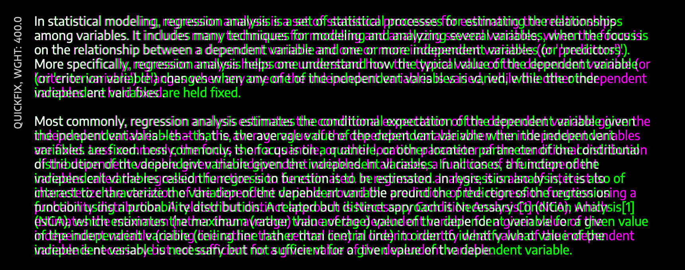

_Even in the corrected wght value, text reflow is still a big problem. Maybe it needs its wdth value corrected, as well?_:

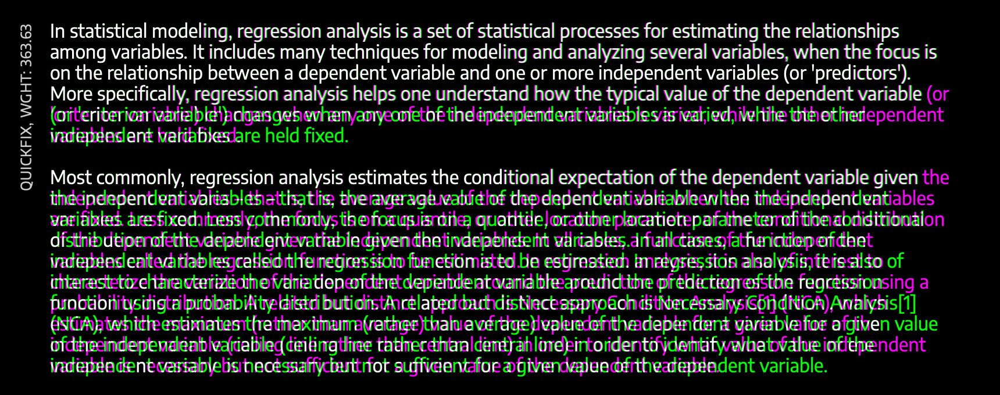

_The “math fix” is much closer to the original static instance_:

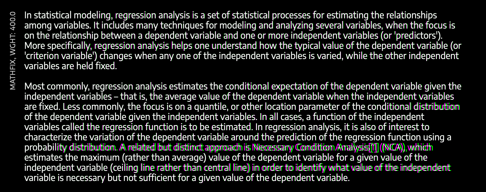

_The “simple fix” is also quite close to the original static instance, which is not too surprising, because it is very similar to the “mathfix,” but just rounded by just 0.883 out of 198_:

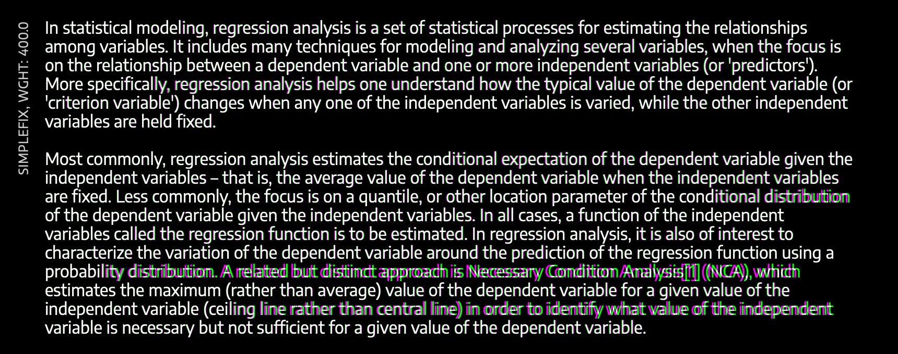

The “math fix” and “simple fix” of the designspace result in lettershapes that are within just a unit or two of the original static fonts. In areas of type are misaligned, it appears to be due to kerning differences, rather than lettershapes or widths (this is partially confirmed because removing kerning in CSS solved much of this, on the gfregressions app). This is a separate issue filed at https://github.com/googlei18n/fontmake/issues/470f.

## **Conclusion: at least for Encode Sans, it is much better to warp the designspace values (“math fix” or “simple fix”) rather than duplicating a master into the corner (“quick fix”).**

Warping the designspace values gives two primary advantages over duplicating a master:

1. The resulting font at the “Regular” position is closer to the static instances / status quo
2. The result is easier to control in both code (with the regular `wght` value at 400) and in a UI (sliders have no “dead spots”)
3. The resulting file VF ttf file size is significantly smaller without duplicating masters. Pre-woff2 compression, the “quick fix” is 359kb while the “math fix” is 287kb the “simple fix” is 286kb.

## **We know a basic way to fix the “cliff,” but** **_where_** **is the proper place to morph the designspace?**

There are two obvious options (and there may be more):

1. A Glyphs script could take the values in Glyphs font data and make the masters & instances into a rectangular designspace (Mike LaGattuta has started [a useful script to do just that](https://www.google.com/url?q=https://github.com/mjlagattuta/Glyphs-Scripts/blob/master/VF-Scripts/Make-Rect-Designspace.py&sa=D&source=hangouts&ust=1539199067743000&usg=AFQjCNHB478UMcw7YLNzos04wlnmVLIlhw), including a preview of glyph shapes which can be viewed before the script morphs axis values).
2. FontMake could, in the process of transforming a Glyphs file into UFOs and a designspace, adjust values to make a rectangular designspace.

It is probably better to allow a fix in the build process, so that Glyphs files can be exported with minimal interference. However, it may also be useful to designers to have a script to run in Glyphs.

In addition, FontBakery should also flag non-rectangular designspaces as a fail state, so that such families can be re-exported with these issues prevented.
