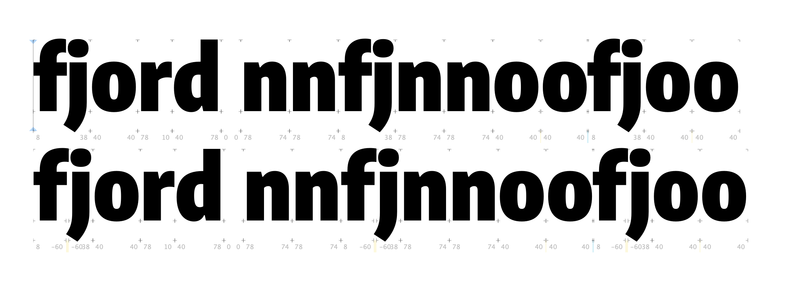
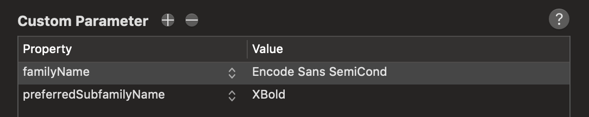

# Working through FontBakery Issues

Some of the FontBakery `FAIL`s and `WARN`s are pretty self-explanatory, so I'll just fix them (e.g. "WARN: Name table strings must not contain the string 'Reserved Font Name'."). Others will take a bit more doing, so I'll document the process here.

## Reserved Font Name

I was at first confused why this continued to warn me, after changing it in the GlyphsApp source. Turns out, the "Reserved Font Name" line was coming from `scripts/NAMEpatch.xml`.

🎉 PASS

## Caret positions for ligatures

> ⚠️ WARN: Are there caret positions declared for every ligature?

Using [my simple glyphs script](https://github.com/thundernixon/glyphs_scripts/blob/master/add-caret-anchors.py) to make this a bit faster and more fun.

🎉 PASS

## Kerning non-ligated sequences

> ⚠️ WARN: Is there kerning info for non-ligated sequences?
> com.google.fonts/check/065
> 
> ⚠️ WARN GPOS table lacks kerning info for the following non-ligated sequences:
> 
> f + i
> i + j
> j + l
> [code: lacks-kern-info]

Do they all need kerning? It helps to look at what the ligatures *are* in the design. The `f_j` and `f_i` ligatures have an `f` which has a shorter top "hook," to avoid a clash between the `f` and the `i`/`j` dot. So, the `/f/i` combination understandably uses positive kerning to also prevent a clash. I matched the `/f/j` combination to it.



I'm confused why FontBakery is advising me to check `j + l` ... I can't find that ligature anywhere in this typeface, and it isn't a very logical ligature for these shapes, anyway. There *is* an `l_j` ligature (for some reason...), but this seems to be somehow getting reverse by FontBakery.

🎉 (I've fixed what is worth fixing.)


## OTS Sanitize

> * 🔥 FAIL: ots-sanitize returned an error code (1). Output follows:
> 
> ERROR: GDEF: bad caret value format: 3
> ERROR: GDEF: Invalid ligature caret list
> ERROR: GDEF: Failed to parse table
> Failed to sanitize file!

- [x] find where the caret value is coming from ... maybe there's an accidental duplication of a `caret_1` in a ligature? Start by looking at the GDEF table.

On line 170 of [ots/src/gdef.cc](https://github.com/khaledhosny/ots/blob/63f8d7e47cf9ab75a25b2b63bb359349fef050fa/src/gdef.cc), there is the following comment:

>       // TODO(bashi): We only support caret value format 1 and 2 for now
>       // because there are no fonts which contain caret value format 3
>       // as far as we investigated.

However, in the TTX of my variable font, I have `<CaretValue index="0" Format="3">` for each caret description in the `<LigCaretList>` table. 

On [MS Docs for the GDEF table](https://docs.microsoft.com/en-us/typography/opentype/otspec140/gdef#ligature-caret-list-table), it says:

> One format represents values in design units only, another fine-tunes a value based on a designated contour point, and the third uses a Device table to adjust values at specific font sizes.

I am simply using the built in GlyphsApp recommendation for inserting caret positions, as described on page 27 of the [Glyphs Handbook](https://glyphsapp.com/downloads/handbook/Glyphs-Handbook-2.3.pdf). So, I'm guessing that if my exported variable font is getting `format 3` either from GlyphsApp or from FontMake's VF exporting.

I have filed this issue at https://github.com/khaledhosny/ots/issues/178 with a few more details.

## Family Naming

> ⚠️ WARN: Combined length of family and style must not exceed 20 characters.

Currently, the longest instance name I can find is:

```
>>> len("Encode Sans ExtraLight SemiCondensed")
36
```

...so, this (and other instances) will definitely require attention in the static instance export.

However, as described in [FontBakery Issue 2179](https://github.com/googlefonts/fontbakery/issues/2179), it is `nameID 4` and `nameID 6` that need to be short enough to avoid issues. For this variable font, `nameID 4`, `Encode Sans Thin Condensed`, clocks in at 26 characters. Because the limits I've been able to find documentation of are between 29 and 32, this variable font is (almost definitely) fine.

On [a posting in the GlyphsApp forum](https://forum.glyphsapp.com/t/overly-strict-font-name-max-length-recommendation-in-naming-tutorial/10164), @mekkablue says that he has "had errors triggered with combined lengths of names that were just above 20" on Windows, though the screenshot provided has a font name with a length of 47 characters ("ImpossibleFamilynameFont-WithAVeryLongStyleName"). I can't help but wondering whether his experience with install failure have had other issues, besides font name length.

I'll test install this on Windows to see whether 26 characters causes any issue.

- [x] Test with virtual machine, windows, and Mac Office
- [x] Be sure to keep exported static instance names below 29 characters

## Keeping static instance exports below 29 characters

It's possible to add `preferredSubfamilyName` custom parameters to a GlyphsApp source. To avoid future potential installation errors, I'll make a script to add in params that shorten names.

- [x] first, export static instances with FontMake to check whether this is taken care of already
- [x] ~~if FontMake doesn't do it, make a script to add your own~~ instead, i've abbreviated windows names

A static instance export of Encode doesn't abbreviate naming. For instance, Condensed ExtraLight exports with:

```
<namerecord nameID="4" platformID="3" platEncID="1" langID="0x409">
      Encode Sans Condensed ExtraLight
</namerecord>
```

### Making a script to shorten names for static instances

`nameID4` must keep below 27–29 characters. There are a couple of ways this might be done:

- Writing a script to add "Preferred Subfamily Names" custom parameter to instances in the GlyphsApp source
- Writing a build script to TTX built fonts, update the names, and then TTX again

I'll start with a test of the Glyphs script, because it has fewer open questions. Also, while it does change the source file, it's still "non-destructive" in the sense that it doesn't alter the source in a way that is hard to reverse.

**Test 1: seeing whether "Preferred Subfamily Names" custom parameters in a GlyphsApp source are picked up by FontMake.**

I've changed the custom parameters manually:



Then exported the specific instance:

```
fontmake -g sources/Encode-Sans.glyphs --output ttf --interpolate "Encode Sans SemiCond XBold" --autohint
```

...But actually, this doesn't seem to export to the designspace or eventual font generated by FontMake, when checked with TTX. It seems that it might be necessary to fix this in post, after all. This will allow me to target the specific XML elements I want to change (nameIDs 4 and 6), and change only those – leaving in-tact the names that won't cause trouble later.


**Test 2: using xmlStarlet to update name IDs 4 & 6, swapping out key words for abbreviations**

| Width         | Abbreviation |
| ------------- | ------------ |
| Condensed     | Cond         |
| SemiCondensed | SemiCond     |
| Expanded      | Expd         |
| SemiExpanded  | SemiExpd     |

| Weight      | Abbreviation |
| ----------- | ------------ |
| ExtraLight  | ExLght       |
| Light       | Lght         |
| Regular (?) | Reg          |
| Medium      | Med          |
| SemiBold    | SemiBld      |
| Bold        | Bold         |
| ExtraBold   | ExBold       |
| Black (?)   | Blck         |


```Python
>>> len("Encode Sans SemiExpd SemiBld")
28
```

Script Logic
- make a dictionary for abbreviations
- for file of directory
    - ttx file
    - make variables: use xmlStarlet to find inner text of `nameID="4"` and `nameID="6"`
    - If words in the inner text are keys of the dict, update variables to associated values
    - use xmlStarlet to update those values


Print value of nameID 4
`xml sel -t -v "//*/namerecord[@nameID='4']" autohinted/instance_ttf/EncodeSansCondensed-ExtraLight.ttx`

and nameID 6...
`xml sel -t -v "//*/namerecord[@nameID='6']" autohinted/instance_ttf/EncodeSansCondensed-ExtraLight.ttx`

EncodeSansCond-ExLght
`xml ed -u "//*/namerecord[@nameID='6']" -v EncodeSansCond-ExLght autohinted/instance_ttf/EncodeSansCondensed-ExtraLight.ttx`


Edit value with this format:
`xml ed -u "/xml/table/rec[@id=1]/numField" -v 0 FILE/PATH/HERE`

To keep line breaks, you can actually just use them in the command:
```
xml ed -u "//*/namerecord[@nameID='6']" -v "
      ${updatedNameID6}
    " autohinted/instance_ttf/EncodeSansCondensed-ExtraLight.ttx > autohinted/instance_ttf/update.ttx
```

Aaaaand done! I've now got this working as a Python script, which will take either a single TTF/OTF file, or a directory full of them, and edit nameIDs 4 and 6 to use abbreviations to avoid future font-installation issues.

I've put this in `scripts/helpers/shorten-nameID-4-6.py`, and I've hooked it up in my build script.

I don't have to run it on the variable font, because nameID 4 is `Encode Sans Thin Condensed` (26 characters), and nameID 6 is `EncodeSans-ThinCondensed` (24 characters). However, if a future variable needs this, it will be easy to add to the build flow.

### Actual instructions for using the name abbreviation script

If anyone comes across this issue, I've made a simple Python script that can be triggered from the command line to abbreviate name IDs `4` & `6` to avoid issues with installation.

As an example, it will take the file `EncodeSansSemiCondensed-ExtraLight.ttf`, which has a full name of `Encode Sans SemiCondensed ExtraLight`, and:
- abbreviate nameID `4` to `Encode Sans SemiCond ExLght` (27 chars) 
- abbreviate nameID `6` to `EncodeSansSemiCond-ExLght` (25 chars)

Here's the helper script:
https://github.com/thundernixon/Encode-Sans/blob/c5eb4d08985e860abf8f7bceb6ce198604992714/scripts/helpers/shorten-nameID-4-6.py (This version is as of Nov 26, 2018 – you may also want to check if it's been updated with any fixes).

It can be run with a command like:

```
python SCRIPT/PATH/shorten-nameID-4-6.py FONT/PATH/font.otf
```

...where you update the script path, as well as the path you're passing in with a TTF/OTF file or a folder of TTF/OTF files. Of course, this is probably most useful when added to a build shell script, in a step following FontMake font generation.

This currently works from a dictionary of style names I chose to shorten in Encode Sans, but if you have other style names, you should add them in the script:

```

abbreviations = {
    "Condensed": "Cond",
    "Expanded": "Expd",
    "Extra": "Ex",
    "Light": "Lght",
    "Regular": "Reg",
    "Medium": "Med"
}
```

If you try it and face any issues or make any improvements, let me know!


## In weight-only VF: name id 266 missing from name table

TTX is giving me the error:

```
WARNING: name id 266 missing from name table
WARNING: name id 267 missing from name table
WARNING: name id 268 missing from name table
WARNING: name id 269 missing from name table
WARNING: name id 270 missing from name table
WARNING: name id 271 missing from name table
```

...and FontBakery is giving the error:

:fire: <b>FAIL:</b> Checking with fontTools.ttx</summary>

* [com.google.fonts/check/ttx-roundtrip](https://github.com/googlefonts/fontbakery/search?q={checkid})
* :fire: **FAIL** name id 266 missing from name table
* :fire: **FAIL** 
* :fire: **FAIL** name id 267 missing from name table
* :fire: **FAIL** name id 268 missing from name table
* :fire: **FAIL** name id 269 missing from name table
* :fire: **FAIL** name id 270 missing from name table
* :fire: **FAIL** name id 271 missing from name table
* :information_source: **INFO** While converting TTF into an XML file, ttx emited the messages listed below.

But why?

Nowhere else in the font TTX can I find reference to `"266"`. The `namerecord`s cover all the named styles:

```
    <namerecord nameID="257" platformID="3" platEncID="1" langID="0x409">
      Thin
    </namerecord>
    <namerecord nameID="258" platformID="3" platEncID="1" langID="0x409">
      ExtraLight
    </namerecord>
    <namerecord nameID="259" platformID="3" platEncID="1" langID="0x409">
      Light
    </namerecord>
    <namerecord nameID="260" platformID="3" platEncID="1" langID="0x409">
      Regular
    </namerecord>
    <namerecord nameID="261" platformID="3" platEncID="1" langID="0x409">
      Medium
    </namerecord>
    <namerecord nameID="262" platformID="3" platEncID="1" langID="0x409">
      SemiBold
    </namerecord>
    <namerecord nameID="263" platformID="3" platEncID="1" langID="0x409">
      Bold
    </namerecord>
    <namerecord nameID="264" platformID="3" platEncID="1" langID="0x409">
      ExtraBold
    </namerecord>
    <namerecord nameID="265" platformID="3" platEncID="1" langID="0x409">
      Black
    </namerecord>
```

🎉 Found it: @mjlagattuta pointed out that it might be a mismatch of the STAT and NAME tables, and sure enough, it was! I hadn't properly understood the STAT table until now, but the values in the `ValueNameID` field need to match values in the NAME table. Resolving this solved the problem.

## On statics: `FAIL: com.google.fonts/check/has_ttfautohint_params`

> **FAIL** Font is lacking ttfautohint params on its version strings on the name table." when you build statics with FontMake & TTFautohint?

It is necessary to add the option `--detailed-info` or `-I` to the autohint. Because of this, autohint must be done in a separate command from the fontmake build command. It uses the following format:

```
ttfautohint -I [PATH]/font.ttf [PATH]/font-hinted.ttf 
```

## On statics: `WARN: Check if OS/2 xAvgCharWidth is correct`

For SC fonts, I'm getting this type of error:

>  **WARN** Check if OS/2 xAvgCharWidth is correct. OS/2 xAvgCharWidth is 1132 but it should be 1160 which corresponds to the weighted average of the widths of the latin lowercase glyphs in the font

However, this is only present in SC fonts, which have swapped smallcaps into the places of lowercase letters. It makes sense that these are slightly wider than the lowercase letters, but it's such a small variance, in such rarely-used`*` versions of the fonts, it probably won't cause any problems.

`*` Alegreya Sans SC gets 19.5M downloads per week, compared to 70.3M for Alegreya Sans (about 27% of the amount of downloads). Alegreya SC gets 9.16M d/w vs 74.0M for Alegreya (about 12%). Spectral SC gets 2.03M d/w, vs 9.79M for Spectral (about 21%).


