# Checking outlines for quality

Approaches:
- Use FontLab6's "FontAudit," which checks for issues in glyph paths
- Use the GlyphsApp plugin *Red Arrows* to check for issues in glyph paths

## Red Arrows

### Inserting inflection points

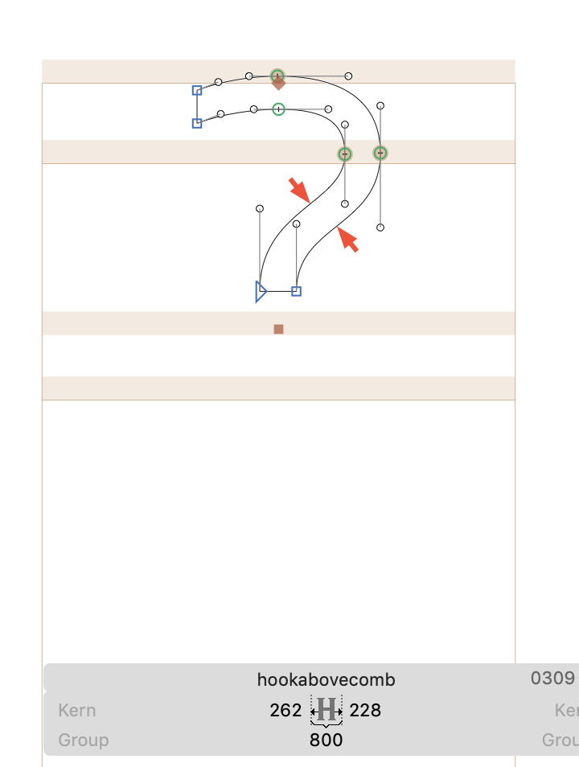

Even when I do fix it, it has a small version of the issue:

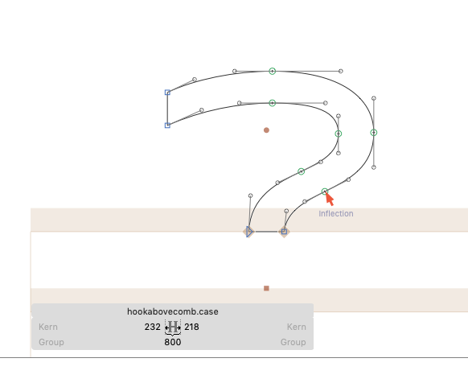

# /oslash issue

Strangely, the `/oslash` component is "reversing" improperly when rendered by Apple Pages or Drawbot (despite other component overlaps being fine, like `/lslash`, `/Hbar`, and even uppercase and smallcap `/Oslash`). The problem is solved if I remove some of the points in the "slash" component.

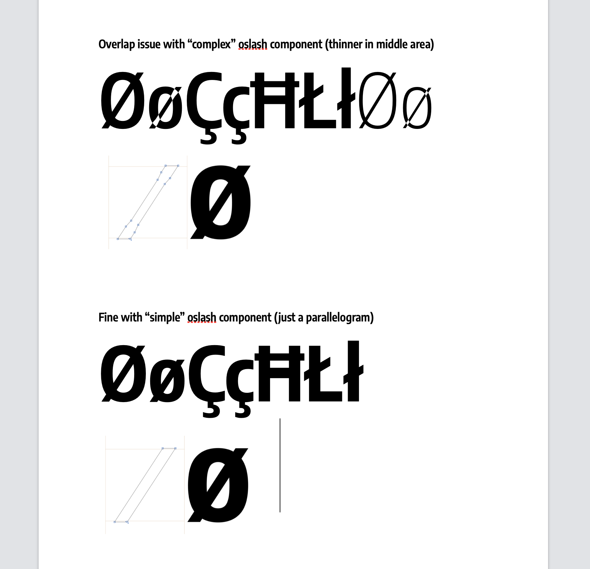

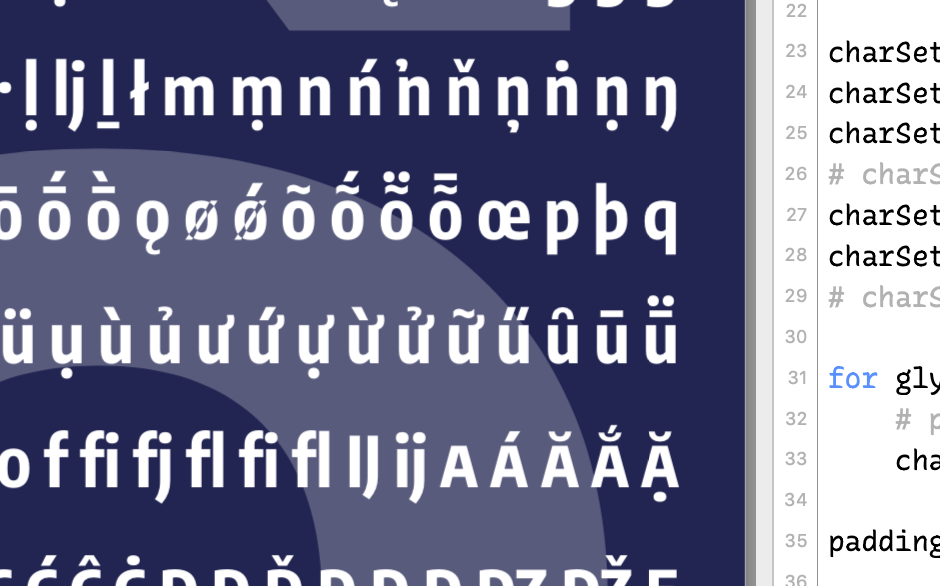

It is fine in Adobe Illustrator and Acrobat.

It's also fine in MS Word.

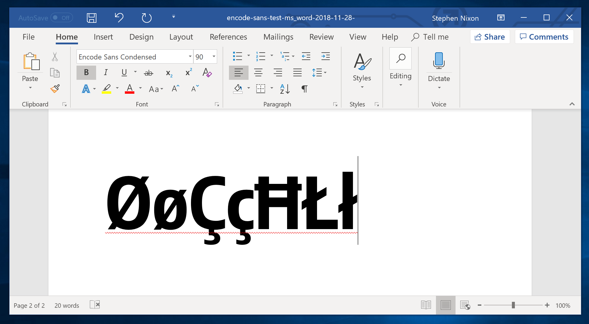

It happens to cap `/Oslash`, too, if it has a complex slash, and to `/oslash` even if its slash it in a few pieces:
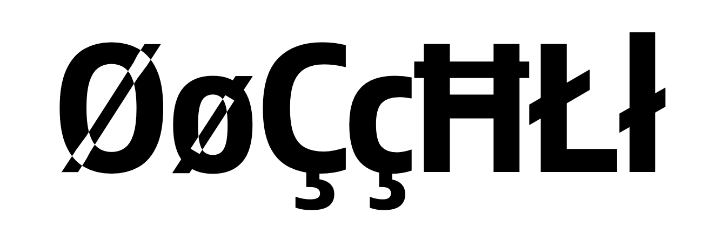

And if it's simplified:

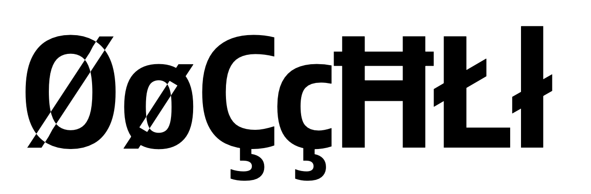

Apple Pages:
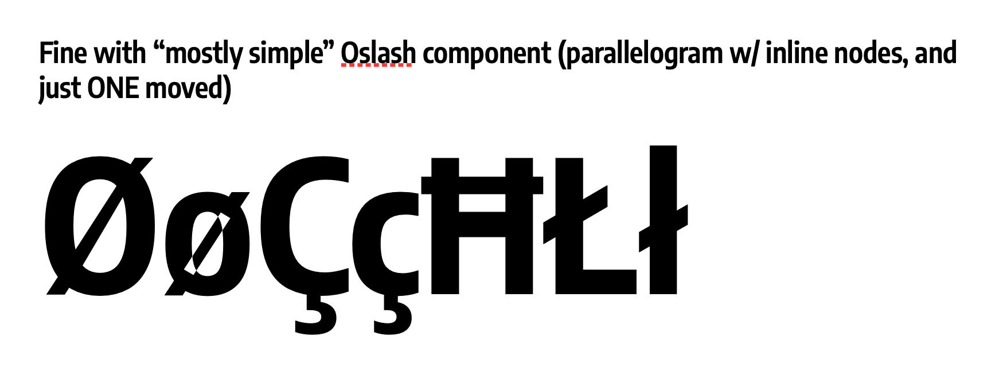

GlyphsApp:

Apple Pages:
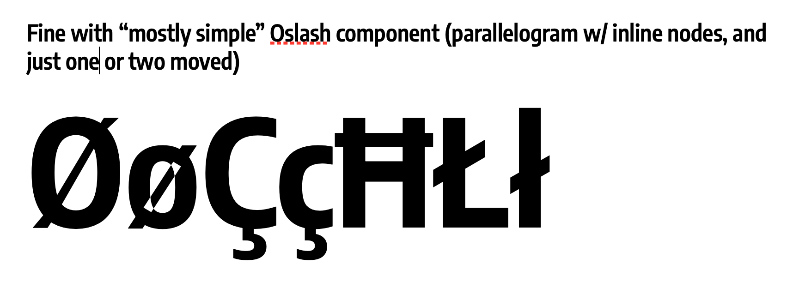

GlyphsApp:
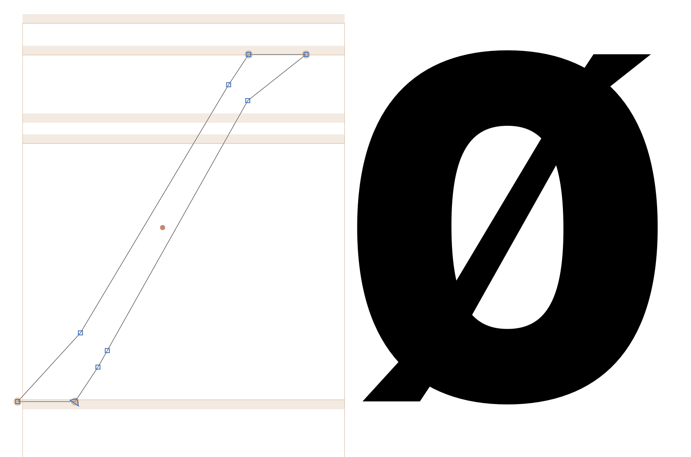

Apple Pages:
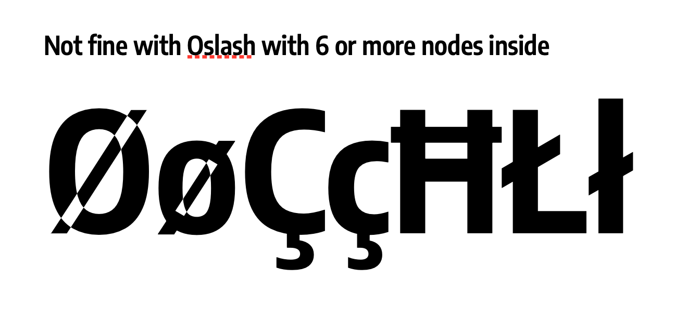

GlyphsApp:
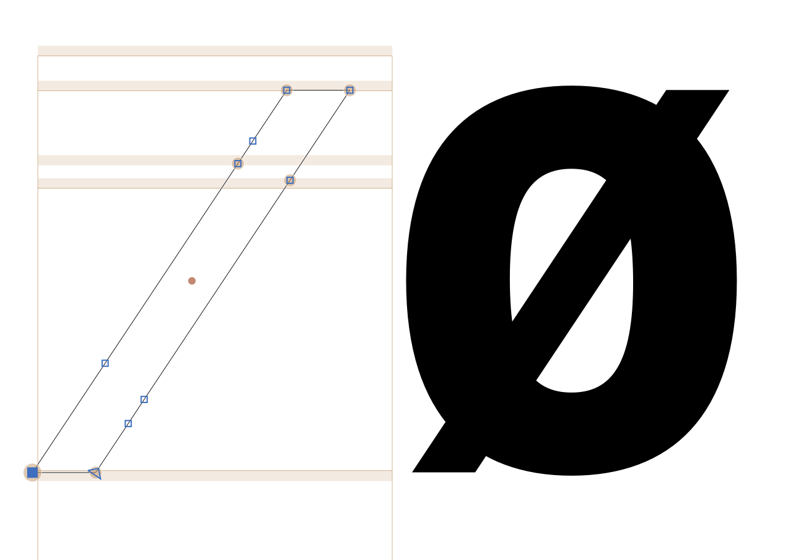

### Oslash is okay with 5 or fewer nodes on the inside of the slash component

Somehow, 6 or more nodes must confuse the renderer to "think" there is a counter space inside those overlap areas.

Apple Pages:
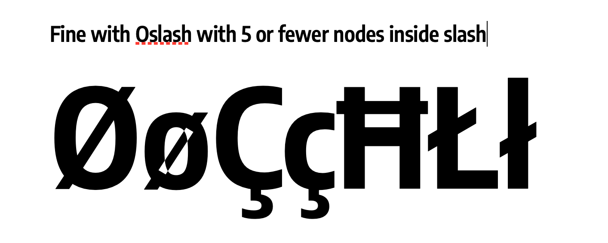

GlyphsApp:
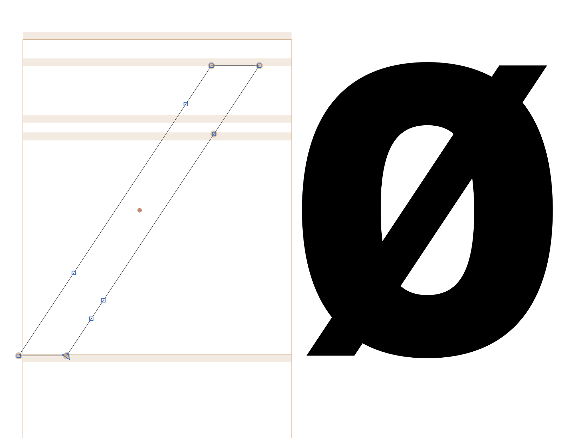

**Conclusion: decompose part or all of the /oslash, as a hack to make the design work.**