# Testing in software and refining fonts

In MS Word and Apple Pages Font instances were arranging first by weight, then by width. This was a very unhelpful arrangement. So, I'm seeing whether changing the NAME table patch might correct this. I'm switching names from a format of `ExtraLight SemiCondensed` to `SemiCondensed ExtraLight`. This might also make sense to change in the GlyphsApp source. 

Changing just the font's NAME table does help organize things better in Apple Pages, but doesn't work how I'd like in MS Word.

Encode Sans VF in Apple Pages:

Encode Sans VF in Microsoft Word:

## Making names better

Based on a TTX of Bahnschrift, an open-source font packaged with Windows, the nameID 4 and 6 doesn't need to include the default weight name. Bahnschrift is simple `Bahnschrift` for both IDs. Additionally, unlike the NAME patch I was using, the `platform="1"` elements in the `<name>` table don't have every style name declared (though they are for `platform="3"`/Mac). These changes may help it to show up in font menus in a more-straightforward way.

.....aaaand they actually do make a difference! The fonts are now showing up in MS Word with the ordering I want, as well as all the styles I expect. 

## Style Linking

One strange thing about Encode Sans in MS Word is that the Regular–Bold style linking works ... but the line height jumps substantially when the Bold style is used.

This doesn't happen in Bahnschrift:

- [ ] TODO: check [Saira](https://github.com/m4rc1e/Saira-1/tree/master/SairaGF/sources) as a possible good weight + width VF reference.

## Name table improvements

I'm using Bahnschrift and the MS Typography docs to upgrade my `NAMEpatch.xml` file slightly.
- I've changed `nameID 2` to "Regular," as this is subbed in for `nameID 17`: "Preferred Subfamily. No name string present, since it is the same as name ID 2 (Font Subfamily name)". This should hopefully make the Regular named instance be used as the default in some apps, rather than the Condensed Thin style.
- I'm changing `nameID 2` from `2.000;GOOG;EncodeSans-ThinCondensed` to `2.000;GOOG;EncodeSans`
- I've changed `nameID`s 4 & 6 to simply `Encode Sans`, from `Encode Sans Condensed Thin`, so it avoids name-length issues and hopefully shows up more simply in font menus
- I've also added specific sample text to `nameID` 19, for display in font-viewing apps.

- [ ] TODO: Check if name patches need to exist for weight-split / linked variable fonts

## Sorting on Mac

Currently, the named instance "Regular" is the default style in macOS pages (good) ... but it's also the first to show up in macOS Pages font menu, when I would expect "Condensed Thin" to be the first to appear, and "Thin" itself doesn't show up until the last place of the menu (bad).

## Do *any* weight & width variable fonts sort well in font menus?

I'm not passing judgement or putting down anyone else's work, but I just want to know: are any of the fonts I think of as "setting the standard" working how I expect in font menus? If they are, I can emulate their NAME and STAT tables. If they aren't, it would seem to be an indication that the issue is at the software application level, more than the font side.

**Bahnschrift, from Microsoft**

- 👍 This starts with the default style (which appears to be Normal width, Regular weight)
- 👍 The default style is titled simply "Bahnschrift" (without style names added)
- 🚫 It groups by weight, rather than width
- 🚫 The ordering of weights isn't predictable (Light, SemiBold, then SemiLight)
- 🚫 The widths within weights aren't what I would expect (normal, Condensed, then SemiCondensed)

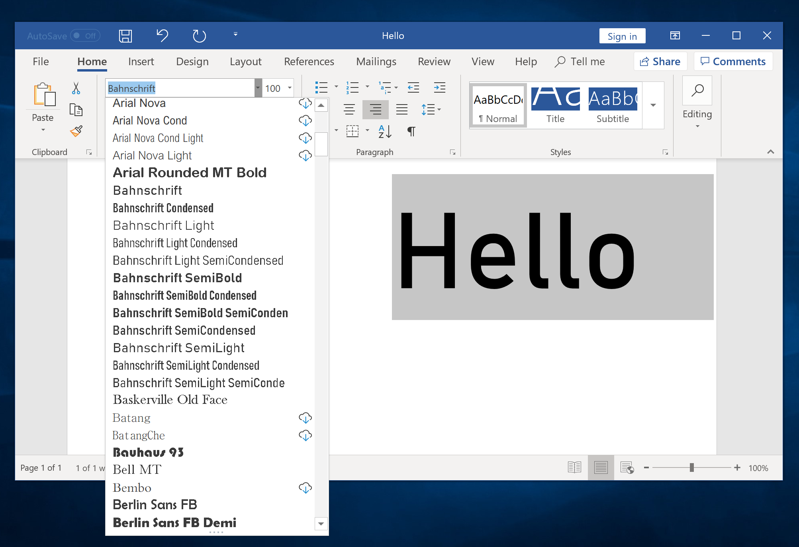

**Venn VF, from Dalton Maag**

- 👍 This starts with the default style (which appears to be Normal width, Regular weight)
- 👍 The default style is titled simply "Venn VF" (without style names added)
- 👍 It groups by width
- 🚫 The ordering of widths isn't predictable (Condensed, Extended, normal, SemiCondensed, then SemiExtended)
- 🚫 The weights within widths aren't predictable (Regular, ExtraBold, Light, Medium)

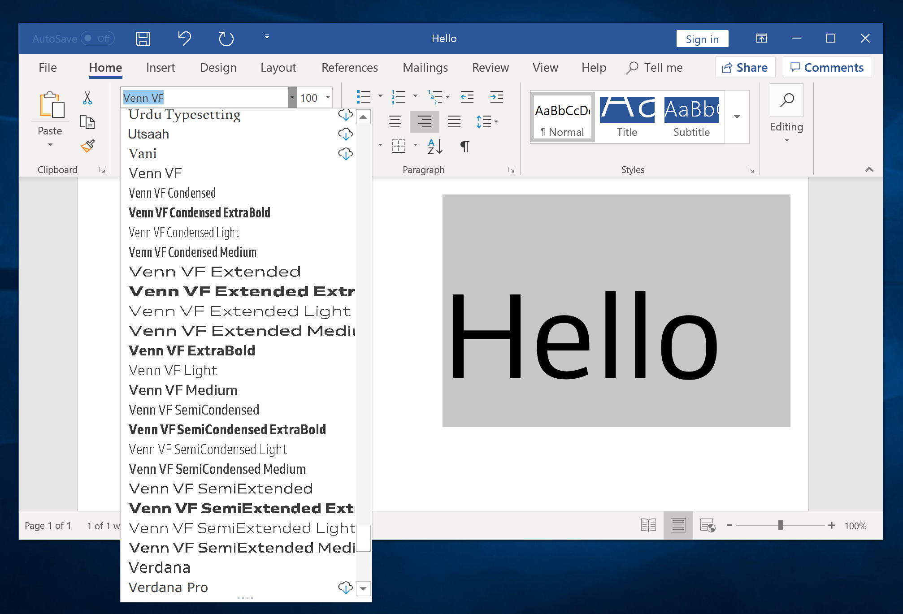

**Barlow, by Tribby Type Co.**

- 🚫 There is no obvious default style
- 🚫 It appears to group by weight first
- 🚫 The instance names are unclear – instead of `[font] [width] [weight]`, they are `[font] [weight] [weight]`
  
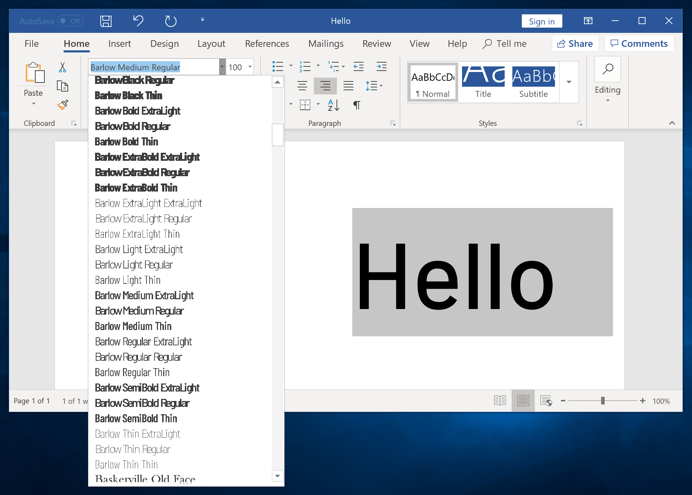

**Conclusion: font menus are messy right now.**

If I can make Encode work better in font menus, I will, but for now, I'll focus on closing out other issues.

## Getting the NAME and STAT tables correct

I had started building with patches for the NAME and STAT tables, but I may have messed them up while working to improve font menu sorting. MS Typography has a helpful example of the STAT table for a weight + width variable font here:
https://docs.microsoft.com/en-us/typography/opentype/spec/stat#example-4-a-weightwidth-variable-font

Earlier, I hadn't understood the linked-purposes of the NAME & STAT tables. Now I'm beginning to wrap my head around it: the NAME tables provide strings necessary for naming, while the STAT table connects those strings to actual values in the font. 

## Checking the NAME and STAT tables in weight + width variable font
- [x] try without patches – are they necessary?
    - the NAME patch is definitely necessary, otherwise styles will all have weight-only names, due to the GlyphsApp instances configuration

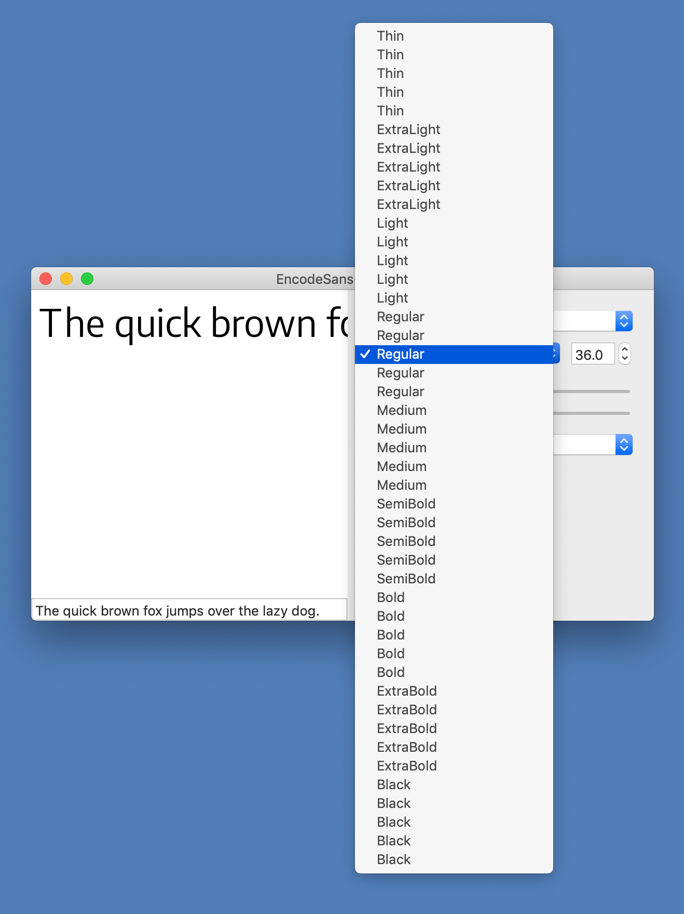

    - Meanwhile, the STAT table only has entries for the two axes, but none that correspond to named instances. This is a problem, because MS Typography says, "Suppose the variable font has 6 named instances that correspond to three different weights for each of two widths. The style attributes table should include axis value records for at least those three weights and those two widths, but could also include records for other weight or width values."

    - *However*, generating a fresh font helps me see things that were incorrect in my NAME table patch. It was missing nameID `0`, for Copyright, and nameID `7`, for Trademark.

- [x] try when "Axes" custom parameter is added to GlyphsApp source
    - this appears to have no impact on the VF built via FontMake. The NAME table still has weight only names (though I never expected this to be different), while the STAT table stil has only two entries (I did hope this might be affected)

- [x] edit tables to match MS typography recommendations
- [x] in NAME table, make sure `platformID` and `platEncID` match: `1` & `0` for Mac, `3` & `1` for Windows
- [x] fix messed-up values in STAT table, which are breaking the build
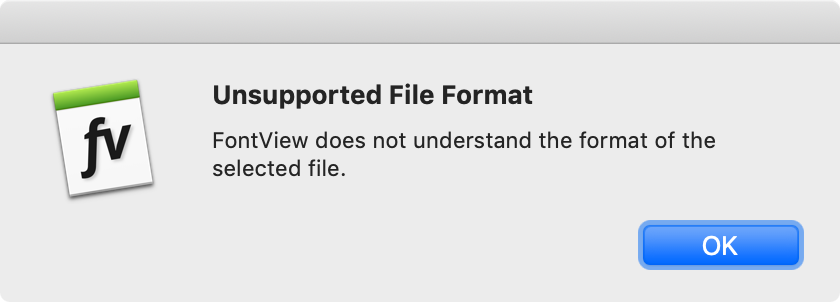

    - Actually, MS Typography says: "***axisOrdering:*** A value that applications can use to determine primary sorting of face names, or for ordering of descriptors when composing family or face names." So, that might be the only required change (once software applications are properly handing VF metadata, at least).
    - The solution: there were typos in certain "format" fields.

- [ ] compare TTX outputs
- [ ] try each in Word & Pages

## Checking the NAME and STAT tables in weight-only variable font
- [ ] try without patches 
- [ ] try with patches
- [ ] compare TTX outputs
- [ ] try each in Word & Pages

## Remove fonts and try again with STAT table minor version `1` (not `2`)

@mjlagattuta suggested building the font with STAT minor version `1`, then retrying on Windows. However, I am having trouble removing the existing font from my Windows VM.

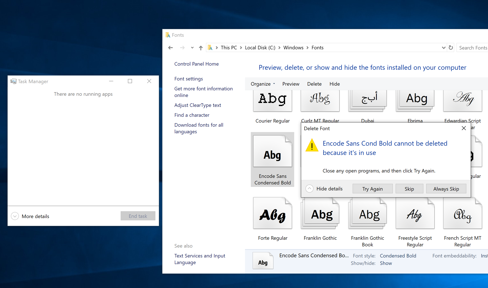

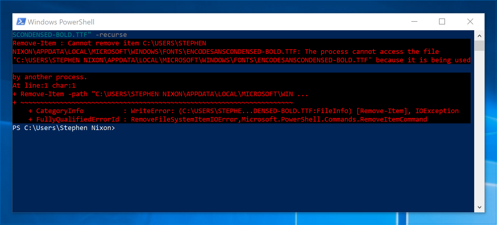

Encode Sans Cond Bold is seemingly impossible to delete, at least with methods Googled. However, installing the full VF again, with STAT minor version `1`, does indeed show more styles in the menu:

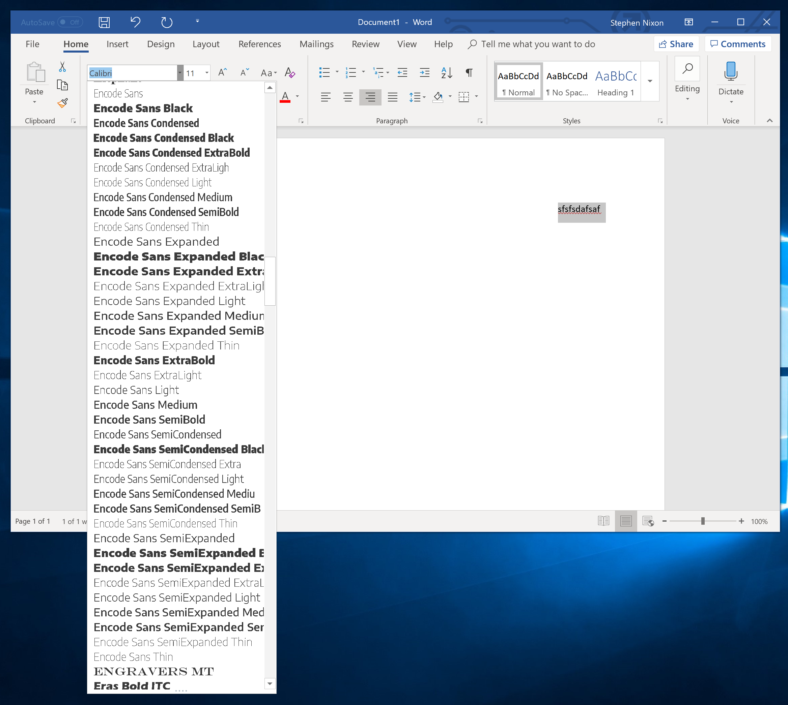

This does, however, point to the need to shorten names, so they don't overflow the MS Word font menu width. I've abbreviated names in the NAME table, and things are (somewhat improved):

As for mac, @mjlagattuta says:

> To fix the naming issue on Mac I think (not entirely sure if this is the right way) the font is supposed to be named in a similar way to the way a static would be named... In this case, nameID1 "Encode Sans Condensed Thin"   ID2 "Regular"   ID16"Encode Sans"  ID17"Condensed Thin"
> This resolves the Mac issue though

**Problem:** With this update, "Condensed Regular" becomes the first option, and "Condensed Thin" becomes the second ... but it actually cues the "Condensed Medium" instance. I need to re-track down what is giving that default weight and width combination.

## Test: does putting "weight" as axis `0` in STAT table improve font menu organization?

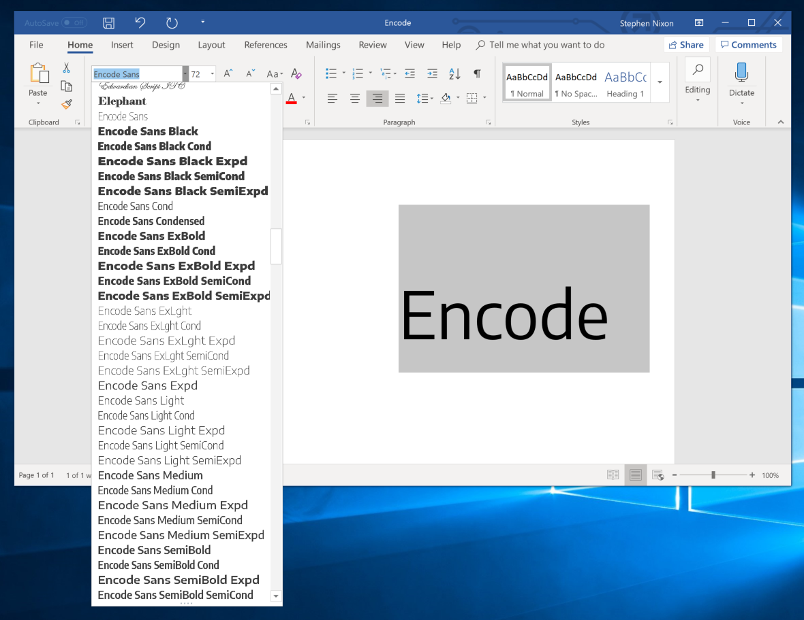

Result: it's still bonkers, just sorting by alphabetical order of style names. I'll also try updating the NAME table patch to this new naming system, though I don't expect that to help much.

Left / first: Pages menu with axis & naming order weight, then width

Right / second: Pages menu with axis & naming order width, then weight

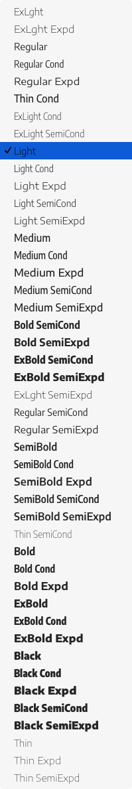 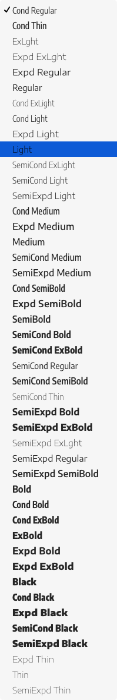

Takeaways:
- The results are different (but weirdly, with more commonalities that I would have expected), but neither is particularly good. It's hard for me to see the exact pattern or logic in either. If I had guess, it seems that Pages is sorting by:
  - a few recognized style names – e.g. "Black" styles are near the bottom, "Light" styles are at the top
  - for unrecognized style names, alphabetical ordering is used – e.g. "Thin" is at the very bottom, and "Semi" names are in the middle 
- macOS Pages is reading from the `platform 3` (windows) entries on the NAME table
  

Partly, font menu ordering doesn't matter that much, compared to other items, because the fonts hosted on Google will be mostly statics at first, and app makers will need to improve how they handle variable fonts. The best I can do is follow the OpenType spec as closely as possible, and let font menus improve over time. I will place width names before weight names, because it is most logical. 