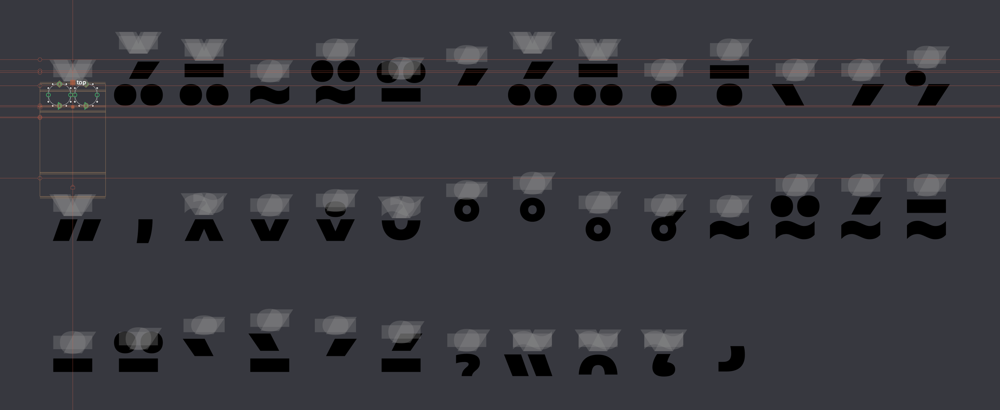
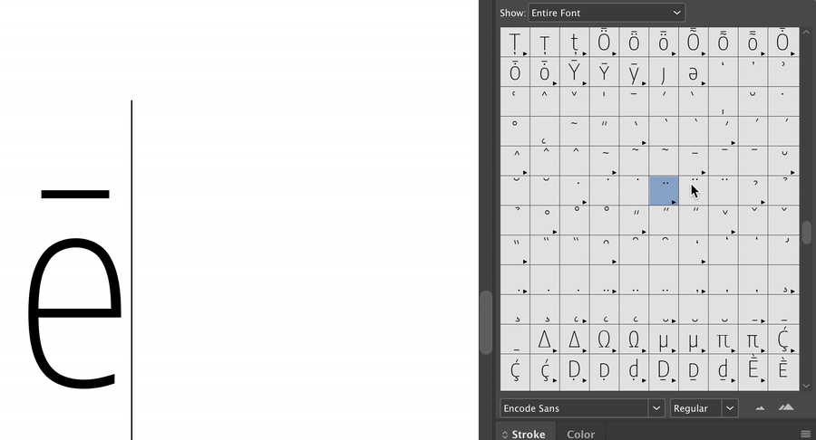
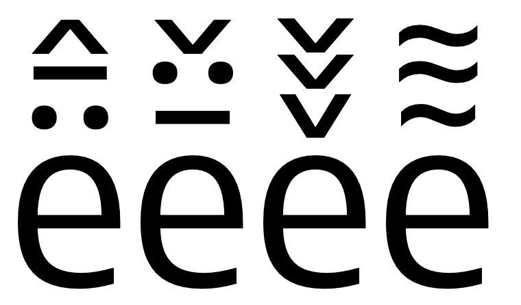
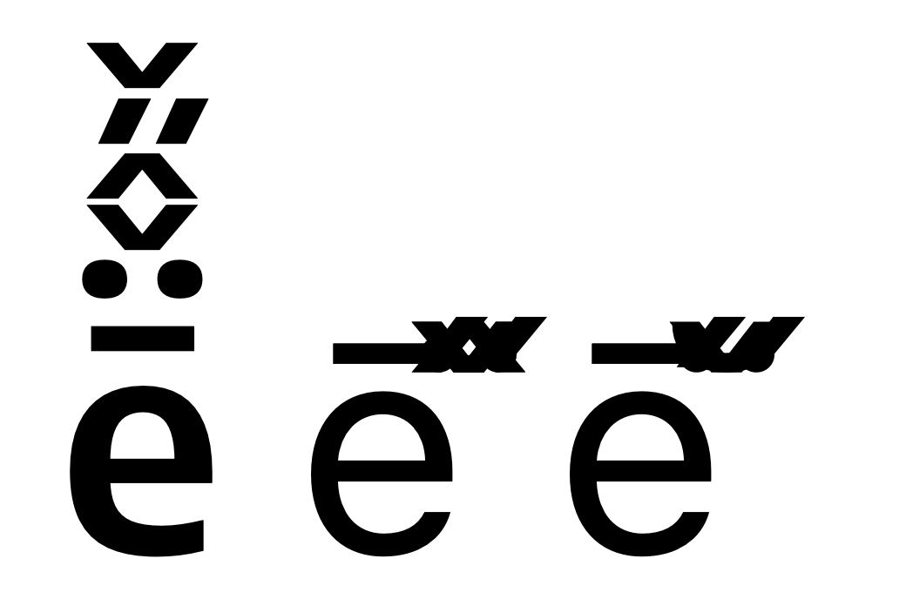
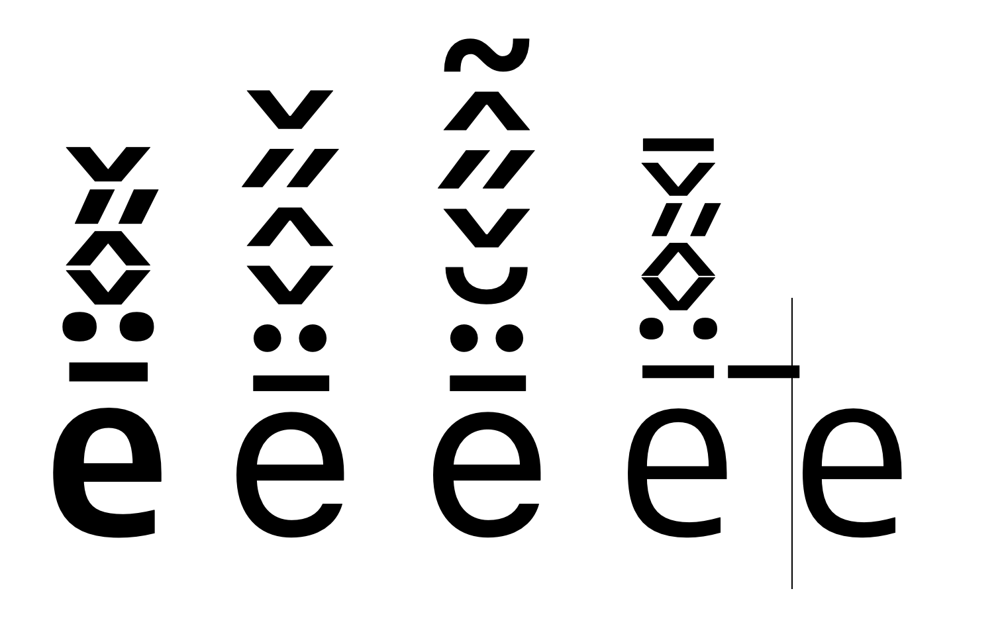
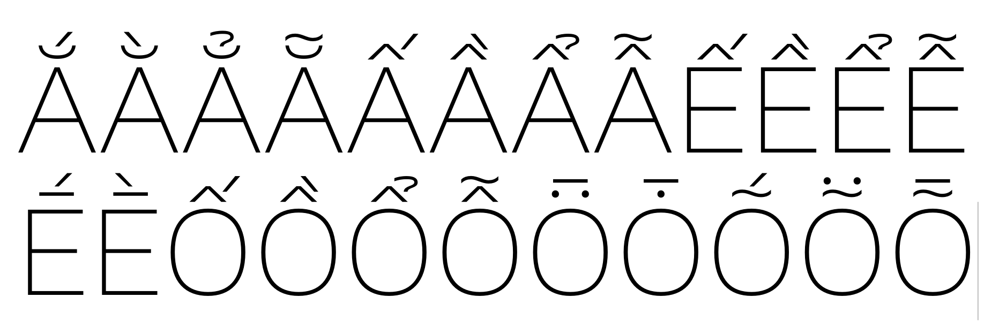
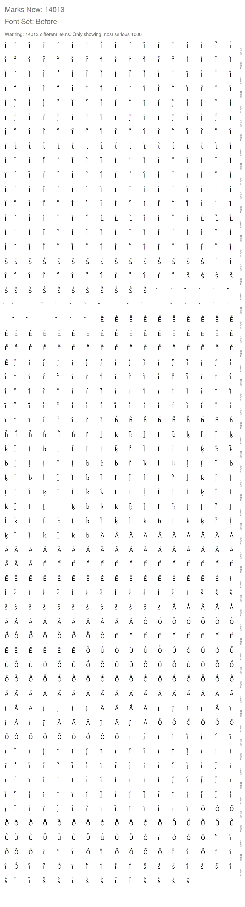
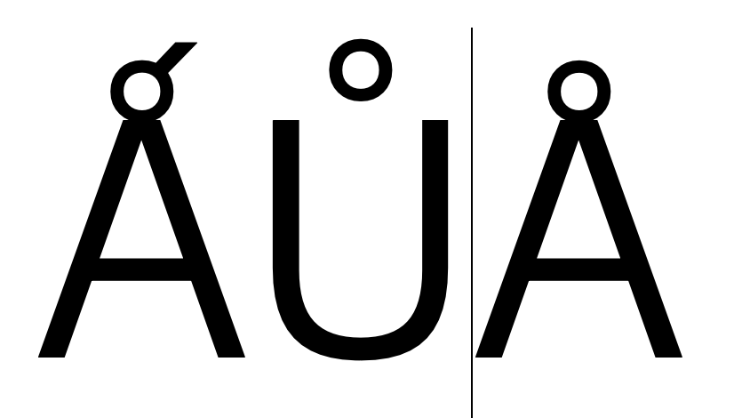
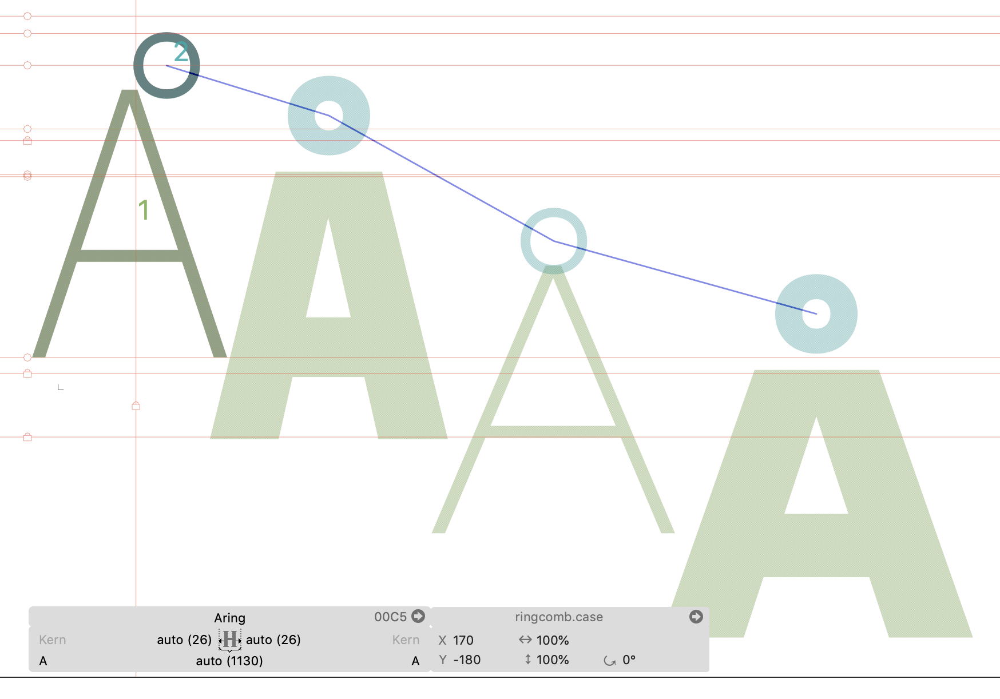
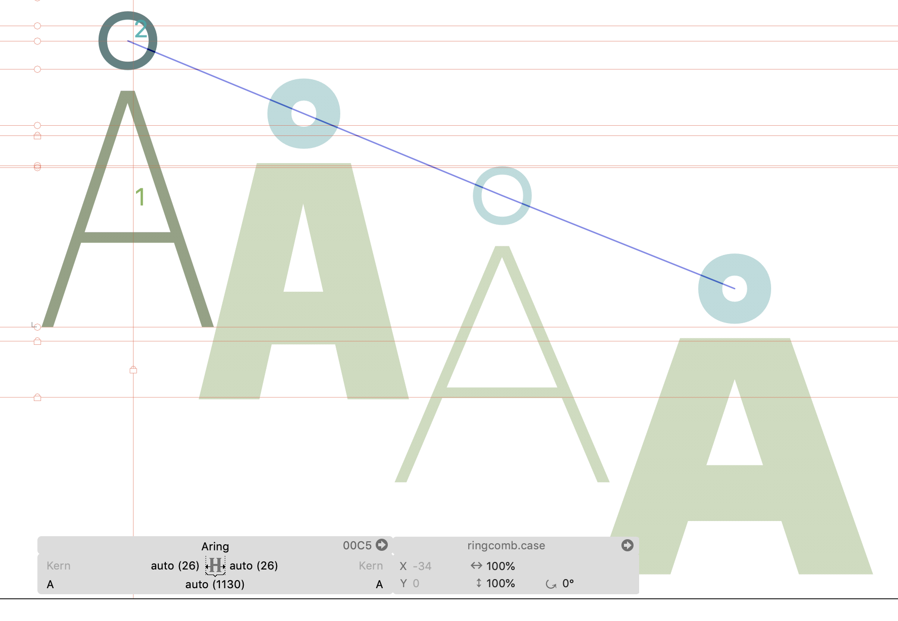

# Fixing collapsed positions in stacked accents/diacritics (`mkmk`)

I thought I was done with Encode Sans ... but then @m4rc1e helped me to get this diff result:


😬 All the accents are collapsing!

Or perhaps I should say

 All the accents are collapsing!

This seems to be due to many of these accents lacking anchors in the GlyphsApp source. So, I'll add these to each `comb` accent (trying to be intelligent about it, and keeping things vertically well-spaced) and try again.


The `.sc` diacritics had no anchors, but because these simply copy the forms of the cap diacritics, I was able to mostly copy these anchor positions over. It helped to copy-paste the string into a code editor, and make the things orderly:


```
/bar/dieresiscomb_acutecomb.case/dieresiscomb_acutecomb.sc/bar/dieresiscomb_macroncomb.case/dieresiscomb_macroncomb.sc/bar/dotaccentcomb.case/dotaccentcomb.sc/bar/dotaccentcomb_macroncomb.case/dotaccentcomb_macroncomb.sc/bar
/bar/gravecomb.case/gravecomb.sc/bar/acutecomb.case/acutecomb.sc/bar/acutecomb_dotaccentcomb.case/acutecomb_dotaccentcomb.sc/bar/hungarumlautcomb.case/hungarumlautcomb.sc/bar
/bar/caroncomb.alt.case/caroncomb.alt.sc/bar/circumflexcomb.case/circumflexcomb.sc/bar/caroncomb.case/caroncomb.sc/bar/caroncomb_dotaccentcomb.case/caroncomb_dotaccentcomb.sc/bar
/bar/brevecomb.case/brevecomb.sc/bar/ringcomb.case/ringcomb.sc/bar/tildecomb.case/tildecomb.sc/bar/tildecomb_dieresiscomb.case/tildecomb_dieresiscomb.sc/bar
```

## Testing before moving fixes into other masters

I've added all the anchors which *I think* are needed to fix diacritic-stacking issues in the Light Condensed master.

Before I replicate this work across the other three masters, I'll generate a Light Condensed instance and diff this against the current Light Condensed font on Google Fonts.

Running
`fontmake -g sources/Encode-Sans.glyphs -i "Encode Sans Expanded Thin" --output ttf`
then
`diffenator /Users/stephennixon/type-repos/google-font-repos/encode-impallari/fonts/EncodeSansExpanded-Thin.ttf instance_ttf/EncodeSansExpanded-Thin.ttf -r out`

I was confused at what was even the "before" and "after" in diffenator tests, so I needed to test to be sure. I put a big rectangle over the `acutecomb` in the source, and confirmed that the second arg in the command really is the after:


Helpfully, this image also shows that my anchor-adding really is having a good effect. The previous version had anchors that were collapsed, but they are now stacking as needed.

## Refining and moving anchors to other masters

After correcting a few issues in the Light Extended anchor positioning, I copied these anchors to glyphs in other masters, for glyphs that did not yet share those anchor points.

Then, I went through each master and adjusted the anchor positions as necessary to give good vertical spacing for anchors.

One "gotcha" has been `/ogonek` accents, which more than other accents has shifted out of place in some cases. In lowercase glyphs, this was due to manual shifting to achieve better connections in ogonek characters. In caps, it was because I had mistakenly labeled the `_ogonek` anchor to a `_bottom` anchor, so it was aligned to the incorrect cap anchor.


For cases like these where something seems suspect about path and anchor alignment, I really appreciate GlyphsApp's function "Show all glyphs containing this component" (found by right-clicking a component).

The slash accent mark also got a bit off:


So I fixed it.

Some accents are way out of place, and it's hard to know why at first.


In this case, I just had to remake it by copying its glyph name into *Glyph > Add Glyphs*.

One of the most useful things is clicking an anchor point (such as `top`) and seeing the "clouds" of accents it shows above all nearby glyphs. This helps me check whether there might be clashes. For instance, this shows that there are near-clashes in the `/macroncomb_dieresiscomb`, `/tildecomb_acutecomb`, `/tildecomb_dieresiscomb`, and `/ringcomb_acutecomb`, which I will fix:



## Turning off most accent ligatures

There are still some problems cause by accent ligatures. Worst, they are a bit unpredictable and hard to prevent from "falling off" of accent stacks. Here is an example from InDesign on Mac:



However, if I remove the parts of the `ccmp` feature code that activates the accent ligatures, it works a lot better in InDesign:


It also works decently in Pages:



Testing it against a system font like SF, Encode now actually seems to function *better* (here, I'm using the unicode panel to add combining marks to an `e`):



(...though, SF does work sometimes, depending on what is following):



...But I'm not debugging SF.

I'll leave these combined-accent glyphs in the font, because they are components themselves, and they are in turn used as components in quite a few other glyphs (here's some of these, in just one case):



And indeed, even though the "marks new" diffs output is now colossal, the "after" glyphs all look quite good, and I don't see any that are collapsed.



## Fixing `/Aring` and `/Aringacute`

There are ugly little crevices here:



This is because this character varies between a "touching" and a detached `/ring` accent on the `/Aring`. It also happens to be just way off in the Light Condensed master.



Instead, for good interpolation and better readability (it's a small sample size, but my one Danish friend has expressed a preference for the detached ring) I will enable auto alignment for the ring in every master.



I'll also fix this for the `/Aringacute`.