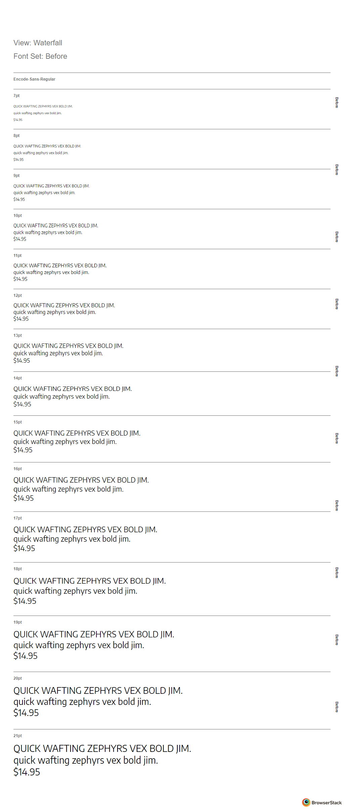

# Encode Sans Autohinting Tests

## Context

In the [Encode Sans PR](https://github.com/google/fonts/pull/1894), Dave asked me to match the previous hinting results better, with the goal of making pixels "jump" or "snap" at the same pt sizes as before.

<b>GIF of before/after</b>

**Marc and I explored TTFautohint & its limitations:**
https://docs.google.com/document/d/1g3ZhFyJBckmyGMxwWsxwLVADltutayrpTe9U-6-oAy8/edit#heading=h.jd78jh9uar5j

## Background on DiffBrowsers & TTFautohint:

- DiffBrowsers tests before/after of font with hinting on different platforms & browsers across multiple Pt sizes.
- Px sizes are 1.333333333x the numerical size of Pt sizes.
- TTFautohint has the param --increase-x-height (https://www.freetype.org/ttfautohint/doc/ttfautohint.html#x-height-increase-limit). Below this value, points will be more likely to round up than down (rounding up when they are above 18.75% of a pixel). The default is value 14px (10.5pt)
- Encode Sans had `--increase-x-height 9`. This meant that below 6.75pt, the pixels should tend to round up.
- DiffBrowsers doesn’t even test below 7pt, so this test effectively shows “natural” rounding of pixels.

### When compared to “before” fonts, the current one…

**Jumps up at**

- 14pt/18.62px (looks slightly stretched)

**Jumps down at**

- 10pt/13.33px (looks more accurate)
- 13pt/17.29px (looks more accurate)

However, because `—increase-x-height` only allows a font to snap up more often in a given size range, it will not be possible to use this param to make it snap down at 14pt/18.62px.

Potentially, the only way to make it snap down at 14pt/18.62px would be to set the max hinting range to 18px, to see whether this prevents snapping at 14pt. `--hinting-range-max=n, -r n`

Likewise, `—increase-x-height` could happen for everything below 18px to help it snap up at 10 & 13 pt.
